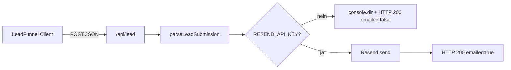
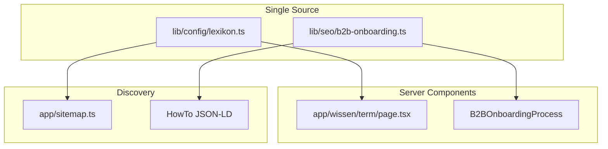
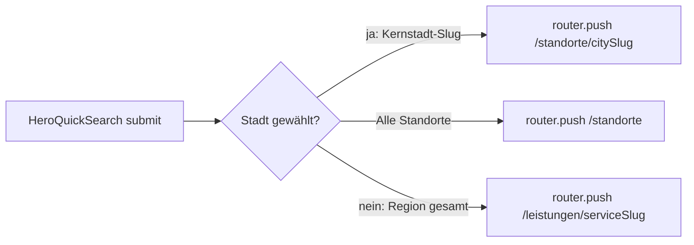
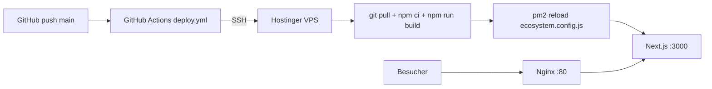

# Architektur: Saubermatik Webplattform

Technisches Referenzdokument (DDD). Dateibaum: `docs/project_structure.md`. Änderungen am Systemfluss **immer** hier und in den fachlichen Docs (`docs/site_architecture.md`, `docs/lead_funnel_spec.md`) nachziehen.

## Tech-Stack

| Schicht | Technologie |
|--------|-------------|
| Framework | **Next.js 16** (App Router, RSC-first) |
| Sprache | **TypeScript** (strict) |
| Styling | **Tailwind CSS v4** (`@import "tailwindcss"`, `@theme` in `app/globals.css`) |
| E-Mail (Transaktional) | **Resend** (`resend`-Paket, Node-Runtime in Route Handlers) |
| Deployment-Ziel | **Hostinger VPS** (PM2 + Nginx); alternativ Vercel-kompatibel (keine DB im UI-Pfad) |
| Security Headers | `next.config.ts` → `headers()` (u. a. `X-Frame-Options`, `X-Content-Type-Options`, `Referrer-Policy`, `Permissions-Policy`) |
| AEO | `app/llms.txt/route.ts` → `/llms.txt` (Plaintext aus `lib/seo/llms-content.ts`) |
| Engagement | `components/EngagementCalculator.tsx` (`"use client"`) — Navboost/Dwell-Time |
| Hero Quick-Search | `components/HeroQuickSearch.tsx` (`"use client"`) — B2B-Leiste Startseite → **Next.js Routing** (`/standorte/[city]/[service]`, `/standorte/[city]`, `/leistungen/[slug]`) |
| Freshness | `lib/utils/date.ts`, `FreshnessBadge`, `dateModified` im globalen JSON-LD |
| Lexikon | `app/wissen/*`, `lib/config/lexikon.ts` (Wiki 2.0, 8 Terms) |
| B2B-Onboarding | `components/B2BOnboardingProcess.tsx`, `lib/seo/b2b-onboarding.ts` (HowTo JSON-LD) |

## Datenfluss: Lead-Erfassung (Kunde)

1. Nutzer durchläuft **`components/LeadFunnel.tsx`** (Client): Leistung → Fläche → Timing → Kontakt (+ optionale Objekthinweise).
2. **`POST /api/lead`** (`app/api/lead/route.ts`) parst den Body mit **`parseLeadSubmission`** (`lib/lead/submission.ts`).
3. Bei konfiguriertem Key: HTML via **`buildGfLeadNotificationHtml`** / Betreff **`getLeadEmailSubject`** (`lib/lead/email.ts`), Absender **`RESEND_FROM_LIVE`**, Empfänger **`LEAD_EMAIL_RECIPIENT`** (Fallback `LEAD_NOTIFICATION_EMAIL`).
4. Antwort: `{ ok, message, emailed? }` → UI zeigt Erfolg oder Hinweis.

## Datenfluss: Bewerbung (Karriere)

- Validierung: **`lib/career/submission.ts`** (E-Mail-Format geteilt mit Lead über **`isValidEmailFormat`**).
- Mail: **`lib/career/email.ts`** — Betreff `📝 BEWERBUNG: [Name]`, HTML-Layout für HR.
- Empfänger-Priorität: **`CAREER_EMAIL_RECIPIENT`** → sonst **`LEAD_EMAIL_RECIPIENT`** → **`LEAD_NOTIFICATION_EMAIL`**.

## Routing & Rendering

- **SSG:** `app/leistungen/[slug]/page.tsx` — `generateStaticParams` aus **`LEISTUNG_SLUGS`** (ohne dedizierte Routen: `unterhaltsreinigung`, `fenster-glasreinigung`, `hausmeisterservice`, `gruenanlagenpflege`). Rendert **`LeistungFaqJsonLd`**, **`LeistungSgeTldr`** (SGE-Kurzblock), **`BreadcrumbJsonLd`**, **`SeoCrossLinks`** (`type="location"`).
- **SSG:** `app/leistungen/hausmeisterservice/page.tsx`, `app/leistungen/gruenanlagenpflege/page.tsx` — **Deep-Content-Landings** (500+ Wörter, eigene Hero-Bilder aus **`lib/config/leistung-images.ts`**).
- **SSG:** Alle **10 Leistungs-Slugs** aus **`lib/config/services.ts`** haben dedizierte Deep-Content-Routen unter `app/leistungen/[slug]/page.tsx` bzw. eigene Ordner – **`app/leistungen/[slug]/page.tsx`** (dynamisch) dient nur noch als Fallback (`notFound`).
- **Deep-Content-Template:** **`components/LeistungDeepPage.tsx`** + **`lib/seo/leistung-deep-content.ts`** (6 Services); Unterhalt, Glas, Hausmeister, Grün manuell erweitert.
- **Position-0-Tabellen:** **`components/SnippetBaitTable.tsx`** — Varianten pro Service (unterhalt, glas, treppenhaus, winterdienst, grundreinigung, fassade, entruempelung, sonstiges).
- **SSG:** `app/zielgruppen/hausverwaltungen/page.tsx` — **B2B-Zielgruppen-Silo** (800+ Wörter) + **`Service`** JSON-LD (`lib/seo/hausverwaltungen-schema.ts`).
- **SSG:** `app/standorte/[city]/page.tsx` — **16 Städte**, **600+ Wörter** via **`buildStandortDeepContent`**; Kernstädte mit **`LOCAL_ENTITIES_BY_CITY`** (Industry Mapping); **`LocalCityFaq`** + FAQPage JSON-LD; **`BreadcrumbJsonLd`**, **`SeoCrossLinks`**.
- **SSG:** `app/standorte/[city]/[service]/page.tsx` — **160 Matrix-Routen** (16×10), **800+ Wörter** via **`buildMatrixDeepContent`** (`lib/seo/matrix-content.ts`); **`MatrixDeepPage`** mit **`EngagementCalculator`**, **`B2BOnboardingProcess`**, **`LeadFunnel`**; `generateStaticParams` aus **`generateMatrixStaticParams()`**.
- **SSG:** `app/standorte/page.tsx` — **Standort-Hub** (`/standorte`): Liste aller City-Spokes + Stuttgart-Spezial.
- **SSG:** `app/standorte/stuttgart/page.tsx` — **Hyper-Local Hub** (kein Eintrag in `STANDORT_CITIES`; feste Route, keine dynamische `[city]`-Kollision). **`SeoCrossLinks`** (`type="service"`).
- **SSG:** `app/expertise/page.tsx` — EEAT-/Standards-Hub (statisch).
- **Hybrid / dynamisch:** **`app/kontakt/page.tsx`** nutzt **`await searchParams`** für serverseitige Text-/Link-Weiche (Karriere vs. Kunde) und rendert das Formular rechts in **`Suspense`** mit Client-**`useSearchParams`** (`components/KontaktFormSwitch.tsx`), damit Client-Navigation und Doku-Vorgabe (Suspense + `useSearchParams`) erfüllt sind.

## Formular-Logik: Kontaktseite

| URL | Linke Spalte (Server) | Rechte Spalte (`Suspense` → `KontaktFormSwitch`) |
|-----|------------------------|--------------------------------------------------|
| `/kontakt` | Kunden-Copy | **`LeadFunnel`** (`#kontakt-anfrage`) |
| `/kontakt?type=karriere` | Karriere-Copy + Link zurück | **`CareerForm`** (`#bewerbung`) |

- **`KontaktFormFallback`**: serverkompatibler Platzhalter; **`isCareer`** kommt aus demselben **`searchParams`**-Snapshot wie die linke Spalte, um UI-Flashes zu minimieren.

## Konfiguration „Single Source of Truth“

- Leistungen inkl. Funnel-Kacheln: **`lib/config/services.ts`** → **`LEAD_SERVICE_TYPES`**, **`FUNNEL_SERVICE_OPTIONS`**, **`LEISTUNGEN_BY_SLUG`** (`lib/routes/leistungen.ts`).
- Firmenadresse / Karte: **`lib/config/site.ts`**.
- API-Basis-URL (Client): **`lib/config/api.ts`** → **`getApiBaseUrl()`**, **`apiUrl()`**; Env **`NEXT_PUBLIC_API_URL`** (leer = same-origin `/api/*`).
- Telefon-Links: **`lib/phone.ts`** (`buildTelHref`).
- JSON-LD **`OfferCatalog`**: aus **`SERVICES`** generiert (`lib/seo/global-jsonld.ts`, eingebunden über **`components/StructuredData.tsx`**) — neue Slugs erscheinen automatisch im Schema. Absolute URLs nutzen **`getSiteOrigin()`** (`lib/seo/site-origin.ts`).

## Client-Bundle (bewusst minimal)

| `"use client"` | Grund |
|----------------|--------|
| `HeroQuickSearch` | Service/Standort-Auswahl, **`useRouter().push`** zu Leistungs- oder Standort-Spoke |
| `ClientLoginButton` | SaaS-Kundenlogin (`NEXT_PUBLIC_PLATFORM_URL`, neuer Tab) |
| `LeadFunnel` | Multi-Step-State, `fetch`, liest optional Kalkulator-Prefill aus `sessionStorage` |
| `CareerForm` | Formular-State, `fetch` |
| `SiteHeaderNav` | Mobile-Menü, Scroll-Lock, Tastatur (Escape), **Hover-Prefetch** (`PrefetchLink`), **aria-label** auf Menü-Button |
| `EngagementCalculator` | 3-Schritt-Kostenrechner (m² oder **WE** für MFH), Scroll + **sessionStorage**-Prefill zum Lead-Funnel |
| `KontaktFormSwitch` | **`useSearchParams`** für `/kontakt`-Weiche |
| `PrefetchLink` | `next/link` + `useRouter().prefetch` auf `pointerenter` für Kern-Routen (Header/Footer) |

Alle übrigen Seiten unter `app/` sind Server Components (inkl. eingebundene **`SeoCrossLinks`**, **`BreadcrumbJsonLd`**, **`LeistungSgeTldr`**, **`B2BOnboardingProcess`**).

## Enterprise B2B-Module (Datenfluss)

- **Lexikon:** `LEXIKON_TERMS` erweitert → `generateStaticParams` auf **`/wissen/[term]`** rendert alle Spokes statisch; **`app/sitemap.ts`** mappt dieselbe Liste (keine Duplikation).
- **HowTo:** `B2B_ONBOARDING_STEPS` speist UI-Timeline und `buildB2BOnboardingHowToJsonLd(pagePath)` — `pagePath` pro Einbindung (`/`, `/qualitaetsmanagement`) für korrekte Step-URLs.

## Hero Trust-Stack (Startseite)

**Layout:** Linker Hero-Stack unter CTAs — kompakt (`gap-2.5`), rechter Hero **`EngagementCalculator`** (`compact`).

| Modul | Komponente | Zweck |
|-------|------------|--------|
| ESG | **`EsgComplianceStatement`** | Osmose, VAH, CSRD/ESG-Rohdaten |
| App-Signal | **`AppMockup`** | Geneigtes Smartphone-Bild (QM-Dashboard) |

## EngagementCalculator — WE-Modus (Hausverwaltung)

| Schritt | Standard (Büro/Glas/Treppe) | B2B MFH (`hausverwaltung`) |
|---------|-----------------------------|----------------------------|
| 1 | Objekttyp-Kachel | Objekttyp-Kachel |
| 2 | Slider **50–2500 m²** | Slider **4–100 WE** (Label: „Anzahl der Wohneinheiten (WE)“) |
| 3 | `monthly = m² × ratePerSqm` | `monthly = WE × ratePerWe(WE)` mit Staffel **18 / 16 / 14 €** pro WE |
| CTA | Scroll `#kontakt-anfrage` + Prefill | Scroll + Prefill; Link **`/zielgruppen/hausverwaltungen#kontakt-anfrage`** |

Prefill-Key: **`saubermatik-calc-prefill`** → **`LeadFunnel`** setzt `objectNotes` und optional `serviceType`, dann entfernt den Key.

## HeroQuickSearch — B2B-Routing-Leiste (Startseite)

**Layout:** Volle Breite im Hero (`app/page.tsx`), **außerhalb** des 2-Spalten-Grids; Startseiten-Container **`max-w-[100rem]`** mit **`px-4 sm:px-8 lg:px-16`**. Hero-Grid: links Trust-Stack (Copy, CTAs, ESG, App-Mockup), rechts **`EngagementCalculator`** (`compact`, `lg:sticky`).

| Feld | Quelle | Routing |
|------|--------|---------|
| Leistung | **`SERVICES`** | `/leistungen/[serviceSlug]` wenn keine Stadt |
| Standort | **`QUICK_SEARCH_CITIES`** | `/standorte/[citySlug]` — **Priorität** vor Leistung |
| „Alle Standorte“ | — | `/standorte` (Hub) |
| CTA | „Jetzt finden“ | **`useRouter`** aus `next/navigation` (Client Component) |

Routing-Logik (Single Source: **`lib/hero/quick-search.ts`** → **`resolveQuickSearchRoute`**).

**Hinweis:** SessionStorage-Prefill (`saubermatik-calc-prefill`, `saubermatik-quick-search-calc`) bleibt für **`EngagementCalculator`** → **`LeadFunnel`**; die Hero-Leiste nutzt kein Scroll-Prefill mehr.

## Deployment — Hostinger VPS

| Datei | Zweck |
|-------|--------|
| **`ecosystem.config.js`** | PM2: App `saubermatik-web`, `npm start`, Cluster, Port 3000 |
| **`.github/workflows/deploy.yml`** | CI/CD: SSH → pull → build → pm2 reload |
| **`ops/nginx-template.conf`** | Reverse Proxy Port 80 → localhost:3000 |
| **`docs/devops_handbuch_fuer_einsteiger.md`** | Einsteiger-Erklärung (VPS, PM2, Nginx, CI/CD) |

**GitHub Secrets:** `SSH_HOST`, `SSH_USER`, `SSH_PRIVATE_KEY`, `DEPLOY_PATH`, optional `SSH_PORT`.  
**Server-Umgebung:** `.env.local` auf dem VPS mit `RESEND_API_KEY`, `NEXT_PUBLIC_*`, etc.
