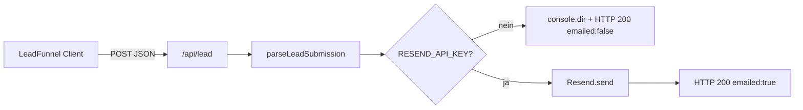
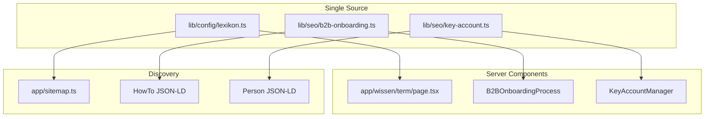

# Architektur: Saubermatik Webplattform

Technisches Referenzdokument (DDD). Dateibaum: `docs/project_structure.md`. Änderungen am Systemfluss **immer** hier und in den fachlichen Docs (`docs/site_architecture.md`, `docs/lead_funnel_spec.md`) nachziehen.

## Tech-Stack

| Schicht | Technologie |
|--------|-------------|
| Framework | **Next.js 16** (App Router, RSC-first) |
| Sprache | **TypeScript** (strict) |
| Styling | **Tailwind CSS v4** (`@import "tailwindcss"`, `@theme` in `app/globals.css`) |
| E-Mail (Transaktional) | **Resend** (`resend`-Paket, Node-Runtime in Route Handlers) |
| Deployment-Ziel | Vercel-kompatibel (keine DB im UI-Pfad) |
| Security Headers | `next.config.ts` → `headers()` (u. a. `X-Frame-Options`, `X-Content-Type-Options`, `Referrer-Policy`, `Permissions-Policy`) |
| AEO | `app/llms.txt/route.ts` → `/llms.txt` (Plaintext aus `lib/seo/llms-content.ts`) |
| Engagement | `components/EngagementCalculator.tsx` (`"use client"`) — Navboost/Dwell-Time |
| Freshness | `lib/utils/date.ts`, `FreshnessBadge`, `dateModified` im globalen JSON-LD |
| Lexikon | `app/wissen/*`, `lib/config/lexikon.ts` (Wiki 2.0, 8 Terms) |
| B2B-Onboarding | `components/B2BOnboardingProcess.tsx`, `lib/seo/b2b-onboarding.ts` (HowTo JSON-LD) |
| Key Account | `components/KeyAccountManager.tsx`, `lib/seo/key-account.ts` (Person/OrganizationRole JSON-LD) |

## Datenfluss: Lead-Erfassung (Kunde)

1. Nutzer durchläuft **`components/LeadFunnel.tsx`** (Client): Leistung → Fläche → Timing → Kontakt (+ optionale Objekthinweise).
2. **`POST /api/lead`** (`app/api/lead/route.ts`) parst den Body mit **`parseLeadSubmission`** (`lib/lead/submission.ts`).
3. Bei konfiguriertem Key: HTML via **`buildGfLeadNotificationHtml`** / Betreff **`getLeadEmailSubject`** (`lib/lead/email.ts`), Absender **`RESEND_FROM_LIVE`**, Empfänger **`LEAD_EMAIL_RECIPIENT`** (Fallback `LEAD_NOTIFICATION_EMAIL`).
4. Antwort: `{ ok, message, emailed? }` → UI zeigt Erfolg oder Hinweis.

## Datenfluss: Bewerbung (Karriere)

- Validierung: **`lib/career/submission.ts`** (E-Mail-Format geteilt mit Lead über **`isValidEmailFormat`**).
- Mail: **`lib/career/email.ts`** — Betreff `📝 BEWERBUNG: [Name]`, HTML-Layout für HR.
- Empfänger-Priorität: **`CAREER_EMAIL_RECIPIENT`** → sonst **`LEAD_EMAIL_RECIPIENT`** → **`LEAD_NOTIFICATION_EMAIL`**.

## Routing & Rendering

- **SSG:** `app/leistungen/[slug]/page.tsx` — `generateStaticParams` aus **`LEISTUNG_SLUGS`** (ohne dedizierte Routen: `unterhaltsreinigung`, `fenster-glasreinigung`, `hausmeisterservice`, `gruenanlagenpflege`). Rendert **`LeistungFaqJsonLd`**, **`LeistungSgeTldr`** (SGE-Kurzblock), **`BreadcrumbJsonLd`**, **`SeoCrossLinks`** (`type="location"`).
- **SSG:** `app/leistungen/hausmeisterservice/page.tsx`, `app/leistungen/gruenanlagenpflege/page.tsx` — **Deep-Content-Landings** (500+ Wörter, eigene Hero-Bilder aus **`lib/config/leistung-images.ts`**).
- **SSG:** `app/leistungen/fenster-glasreinigung/page.tsx` — **Glasreinigungs-Silo** (800+ Wörter): Reinwasser-Osmose, Handwerk, TRBS 2121; Hero via **`GeoImage`**; **`EngagementCalculator`** mit `initialCategory="glas"`; Redirect **`/leistungen/glasreinigung`** → kanonische Route.
- **SSG:** `app/zielgruppen/hausverwaltungen/page.tsx` — **B2B-Zielgruppen-Silo** (800+ Wörter) + **`Service`** JSON-LD (`lib/seo/hausverwaltungen-schema.ts`).
- **SSG:** `app/standorte/[city]/page.tsx` — `generateStaticParams` aus **`STANDORT_CITIES`** (16 Städte). Optional **lokale Entity-Injektion** aus **`lib/seo/local-entities.ts`** (Kernstädte) + **`BreadcrumbJsonLd`** (mit Hub **`/standorte`**) + **`SeoCrossLinks`** (`type="service"`).
- **SSG:** `app/standorte/page.tsx` — **Standort-Hub** (`/standorte`): Liste aller City-Spokes + Stuttgart-Spezial.
- **SSG:** `app/standorte/stuttgart/page.tsx` — **Hyper-Local Hub** (kein Eintrag in `STANDORT_CITIES`; feste Route, keine dynamische `[city]`-Kollision). **`SeoCrossLinks`** (`type="service"`).
- **SSG:** `app/expertise/page.tsx` — EEAT-/Standards-Hub (statisch).
- **Hybrid / dynamisch:** **`app/kontakt/page.tsx`** nutzt **`await searchParams`** für serverseitige Text-/Link-Weiche (Karriere vs. Kunde) und rendert das Formular rechts in **`Suspense`** mit Client-**`useSearchParams`** (`components/KontaktFormSwitch.tsx`), damit Client-Navigation und Doku-Vorgabe (Suspense + `useSearchParams`) erfüllt sind.

## Formular-Logik: Kontaktseite

| URL | Linke Spalte (Server) | Rechte Spalte (`Suspense` → `KontaktFormSwitch`) |
|-----|------------------------|--------------------------------------------------|
| `/kontakt` | Kunden-Copy | **`LeadFunnel`** (`#kontakt-anfrage`) |
| `/kontakt?type=karriere` | Karriere-Copy + Link zurück | **`CareerForm`** (`#bewerbung`) |

- **`KontaktFormFallback`**: serverkompatibler Platzhalter; **`isCareer`** kommt aus demselben **`searchParams`**-Snapshot wie die linke Spalte, um UI-Flashes zu minimieren.

## Konfiguration „Single Source of Truth“

- Leistungen inkl. Funnel-Kacheln: **`lib/config/services.ts`** → **`LEAD_SERVICE_TYPES`**, **`FUNNEL_SERVICE_OPTIONS`**, **`LEISTUNGEN_BY_SLUG`** (`lib/routes/leistungen.ts`).
- Firmenadresse / Karte: **`lib/config/site.ts`**.
- Telefon-Links: **`lib/phone.ts`** (`buildTelHref`).
- JSON-LD **`OfferCatalog`**: aus **`SERVICES`** generiert (`lib/seo/global-jsonld.ts`, eingebunden über **`components/StructuredData.tsx`**) — neue Slugs erscheinen automatisch im Schema. Absolute URLs nutzen **`getSiteOrigin()`** (`lib/seo/site-origin.ts`).

## Client-Bundle (bewusst minimal)

| `"use client"` | Grund |
|----------------|--------|
| `LeadFunnel` | Multi-Step-State, `fetch`, liest optional Kalkulator-Prefill aus `sessionStorage` |
| `CareerForm` | Formular-State, `fetch` |
| `SiteHeaderNav` | Mobile-Menü, Scroll-Lock, Tastatur (Escape), **Hover-Prefetch** (`PrefetchLink`), **aria-label** auf Menü-Button |
| `EngagementCalculator` | 3-Schritt-Kostenrechner (m² oder **WE** für MFH), Scroll + **sessionStorage**-Prefill zum Lead-Funnel |
| `KontaktFormSwitch` | **`useSearchParams`** für `/kontakt`-Weiche |
| `PrefetchLink` | `next/link` + `useRouter().prefetch` auf `pointerenter` für Kern-Routen (Header/Footer) |

Alle übrigen Seiten unter `app/` sind Server Components (inkl. eingebundene **`SeoCrossLinks`**, **`BreadcrumbJsonLd`**, **`LeistungSgeTldr`**, **`B2BOnboardingProcess`**, **`KeyAccountManager`**).

## Enterprise B2B-Module (Datenfluss)

- **Lexikon:** `LEXIKON_TERMS` erweitert → `generateStaticParams` auf **`/wissen/[term]`** rendert alle Spokes statisch; **`app/sitemap.ts`** mappt dieselbe Liste (keine Duplikation).
- **HowTo:** `B2B_ONBOARDING_STEPS` speist UI-Timeline und `buildB2BOnboardingHowToJsonLd(pagePath)` — `pagePath` pro Einbindung (`/`, `/qualitaetsmanagement`) für korrekte Step-URLs.
- **Key Account:** Copy + Schema zentral in **`lib/seo/key-account.ts`**; Einbindung auf **`/ueber-uns`** (volle Sektion) und **`/kontakt`** (flankierend, `showCta={false}` neben Lead-Funnel).

## EngagementCalculator — WE-Modus (Hausverwaltung)

| Schritt | Standard (Büro/Glas/Treppe) | B2B MFH (`hausverwaltung`) |
|---------|-----------------------------|----------------------------|
| 1 | Objekttyp-Kachel | Objekttyp-Kachel |
| 2 | Slider **50–2500 m²** | Slider **4–100 WE** (Label: „Anzahl der Wohneinheiten (WE)“) |
| 3 | `monthly = m² × ratePerSqm` | `monthly = WE × ratePerWe(WE)` mit Staffel **18 / 16 / 14 €** pro WE |
| CTA | Scroll `#kontakt-anfrage` + Prefill | Scroll + Prefill; Link **`/zielgruppen/hausverwaltungen#kontakt-anfrage`** |

Prefill-Key: **`saubermatik-calc-prefill`** → **`LeadFunnel`** setzt `objectNotes` und optional `serviceType` (`hausmeisterservice`), dann entfernt den Key.
