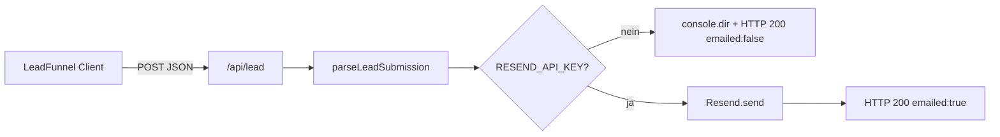

# Architektur: Saubermatik Webplattform

Technisches Referenzdokument (DDD). Dateibaum: `docs/project_structure.md`. Änderungen am Systemfluss **immer** hier und in den fachlichen Docs (`docs/site_architecture.md`, `docs/lead_funnel_spec.md`) nachziehen.

## Tech-Stack

| Schicht | Technologie |
|--------|-------------|
| Framework | **Next.js 16** (App Router, RSC-first) |
| Sprache | **TypeScript** (strict) |
| Styling | **Tailwind CSS v4** (`@import "tailwindcss"`, `@theme` in `app/globals.css`) |
| E-Mail (Transaktional) | **Resend** (`resend`-Paket, Node-Runtime in Route Handlers) |
| Deployment-Ziel | Vercel-kompatibel (keine DB im UI-Pfad) |

## Datenfluss: Lead-Erfassung (Kunde)

1. Nutzer durchläuft **`components/LeadFunnel.tsx`** (Client): Leistung → Fläche → Timing → Kontakt (+ optionale Objekthinweise).
2. **`POST /api/lead`** (`app/api/lead/route.ts`) parst den Body mit **`parseLeadSubmission`** (`lib/lead/submission.ts`).
3. Bei konfiguriertem Key: HTML via **`buildGfLeadNotificationHtml`** / Betreff **`getLeadEmailSubject`** (`lib/lead/email.ts`), Absender **`RESEND_FROM_LIVE`**, Empfänger **`LEAD_EMAIL_RECIPIENT`** (Fallback `LEAD_NOTIFICATION_EMAIL`).
4. Antwort: `{ ok, message, emailed? }` → UI zeigt Erfolg oder Hinweis.

## Datenfluss: Bewerbung (Karriere)

- Validierung: **`lib/career/submission.ts`** (E-Mail-Format geteilt mit Lead über **`isValidEmailFormat`**).
- Mail: **`lib/career/email.ts`** — Betreff `📝 BEWERBUNG: [Name]`, HTML-Layout für HR.
- Empfänger-Priorität: **`CAREER_EMAIL_RECIPIENT`** → sonst **`LEAD_EMAIL_RECIPIENT`** → **`LEAD_NOTIFICATION_EMAIL`**.

## Routing & Rendering

- **SSG:** `app/leistungen/[slug]/page.tsx` — `generateStaticParams` aus **`LEISTUNG_SLUGS`** (ohne Duplikat `unterhaltsreinigung`, eigene Route).
- **SSG:** `app/standorte/[city]/page.tsx` — `generateStaticParams` aus **`STANDORT_CITIES`** (16 Städte).
- **Hybrid / dynamisch:** **`app/kontakt/page.tsx`** nutzt **`await searchParams`** für serverseitige Text-/Link-Weiche (Karriere vs. Kunde) und rendert das Formular rechts in **`Suspense`** mit Client-**`useSearchParams`** (`components/KontaktFormSwitch.tsx`), damit Client-Navigation und Doku-Vorgabe (Suspense + `useSearchParams`) erfüllt sind.

## Formular-Logik: Kontaktseite

| URL | Linke Spalte (Server) | Rechte Spalte (`Suspense` → `KontaktFormSwitch`) |
|-----|------------------------|--------------------------------------------------|
| `/kontakt` | Kunden-Copy | **`LeadFunnel`** (`#kontakt-anfrage`) |
| `/kontakt?type=karriere` | Karriere-Copy + Link zurück | **`CareerForm`** (`#bewerbung`) |

- **`KontaktFormFallback`**: serverkompatibler Platzhalter; **`isCareer`** kommt aus demselben **`searchParams`**-Snapshot wie die linke Spalte, um UI-Flashes zu minimieren.

## Konfiguration „Single Source of Truth“

- Leistungen inkl. Funnel-Kacheln: **`lib/config/services.ts`** → **`LEAD_SERVICE_TYPES`**, **`FUNNEL_SERVICE_OPTIONS`**, **`LEISTUNGEN_BY_SLUG`** (`lib/routes/leistungen.ts`).
- Firmenadresse / Karte: **`lib/config/site.ts`**.
- Telefon-Links: **`lib/phone.ts`** (`buildTelHref`).
- JSON-LD **`OfferCatalog`**: aus **`SERVICES`** generiert (`components/StructuredData.tsx`) — neue Slugs erscheinen automatisch im Schema.

## Client-Bundle (bewusst minimal)

| `"use client"` | Grund |
|----------------|--------|
| `LeadFunnel` | Multi-Step-State, `fetch` |
| `CareerForm` | Formular-State, `fetch` |
| `SiteHeaderNav` | Mobile-Menü, Scroll-Lock, Tastatur (Escape) |
| `KontaktFormSwitch` | **`useSearchParams`** für `/kontakt`-Weiche |

Alle übrigen Seiten unter `app/` sind Server Components.
